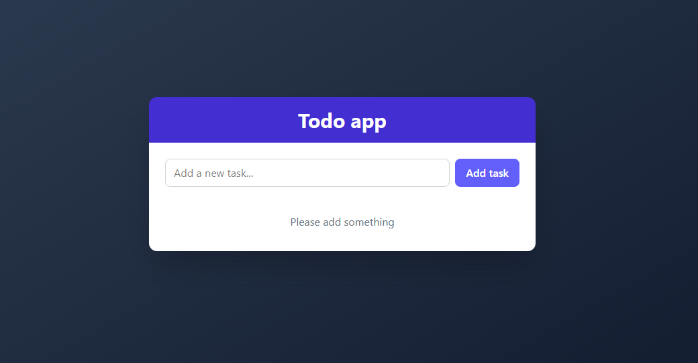

# Todo App

A modern, responsive Todo application built with React, TypeScript, and Tailwind CSS.



## Features

- ✅ Create, toggle, and delete tasks
- 💾 Persistent storage using localStorage
- 🎨 Modern UI with Tailwind CSS
- 📱 Fully responsive design
- 🔔 Toast notifications for user actions
- ⚡ Optimized performance with React.memo and useCallback

## Demo

Check out the live demo [here](https://florin392.github.io/todoapp/).

## Tech Stack

- React
- TypeScript
- Tailwind CSS
- react-hot-toast for notifications
- nanoid for unique IDs

## Installation

1. Clone the repository:
   ```bash
   git clone https://github.com/Florin392/todoapp.git
   cd todoapp
   ```

2. Install dependencies:
   ```bash
   npm install
   ```

3. Run the development server:
   ```bash
   npm run dev
   ```

4. Open your browser and navigate to `http://localhost:5173`

## Project Structure

```
src/
├── components/
│   ├── TodoInput.tsx   # Input component for adding new todos
│   ├── TodoItem.tsx    # Individual todo item component
│   └── TodoList.tsx    # Container for todo items
├── constants/
│   └── toastValidationMessages.ts   # Toast notification messages
├── hooks/
│   └── useTodos.ts     # Custom hook for todo management
├── types/
│   └── types.ts        # TypeScript interfaces
├── utils/
│   └── localStorage.ts # Local storage utility functions
├── App.tsx             # Main application component
└── main.tsx           # Entry point
```

## Usage

- **Add a Task**: Enter text in the input field and click "Add task" or press Enter
- **Complete a Task**: Click the checkbox next to a task
- **Edit a Task**: Double click on the task text to edit it 
- **Delete a Task**: Click the "Delete" button (visible on hover on desktop)

## Testing

Run the test suite with:

```bash
npm test
```

The application includes tests for:
- TodoList component
- TodoInput component
- useTodos hook
- localStorage utilities

## Acknowledgements

- [React](https://reactjs.org/)
- [TypeScript](https://www.typescriptlang.org/)
- [Tailwind CSS](https://tailwindcss.com/)
- [react-hot-toast](https://react-hot-toast.com/)
- [nanoid](https://github.com/ai/nanoid)